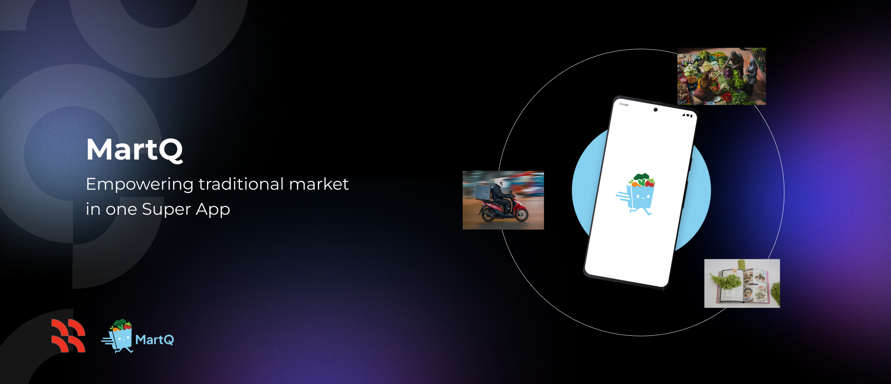
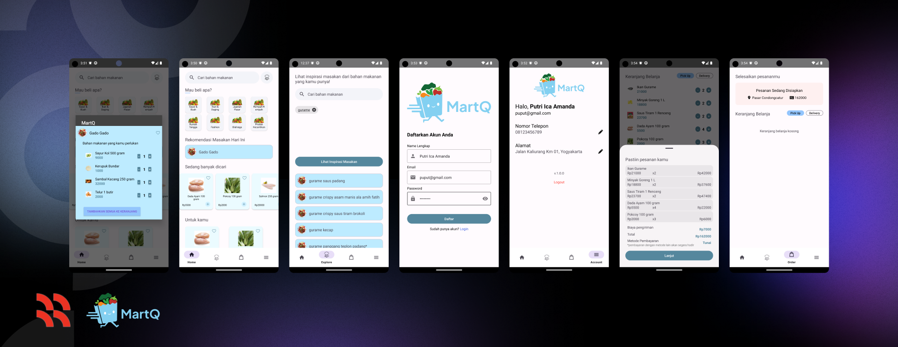

# Welcome to MartQ!
MartQ is a revolutionary traditional market shopping, powered by the CH2-PS553 team from [Bangkit Academy led by Google, Tokopedia, Gojek, & Traveloka](https://www.linkedin.com/company/bangkit-academy/mycompany/) 2023 H2.

MartQ offer a convenient platform designed to provide users with:
- 🍲 **Diverse Culinary Inspiration**
- 🌽 **Reducing Food Waste**
- 🛍 **Affordable Freshness**
- 💨 **Seamless Order Experience**

Watch the demo [here](https://drive.google.com/file/d/1vwcCY8AWuxdJw4w4amz6jp0VTM5q7l4L/view?usp=sharing).

## Team ID : CH2-PS553
### [Machine Learning](https://github.com/Mart-Q/machine-learning#readme)

M183BSY0890 – Rendra Baskoro Tuharea – Universitas Amikom Yogyakarta

M183BSX1681 – Mufidatul Ngazizah – Universitas Amikom Yogyakarta

M316BSY1231 – Muhammad Khatama Insani – Universitas Stikubank Semarang

### [Cloud Computing](https://github.com/Mart-Q/Backend-Python#readme)

C183BSY3323 – Andi Muhammad Ichsan Jalaluddin – Universitas Amikom Yogyakarta

C008BSY4057 – Andi Muhammad Yanwar – Universitas Gadjah Mada

### [Mobile Developmnet](https://github.com/Mart-Q/android-app#readme)

A008BSX2641 – Niki Hidayati – Universitas Gadjah Mada

## Contact
For any inquiries or feedback, please contact the project team at [martq.bangkit@gmail.com](mailto:martq.bangkit@gmail.com)
